# Introduction
The following file aims to describe the contents of "set-cover.ipynb" and its "findings". 

The solution of the set-cover problem utilized the provided cost and validation functions, while for the fitness, it uses a solution proposed in class, which is tuple containing validity and cost * -1.    

The outputs provided are relative to a problem enunciation with small numbers, as my computer is not able to compute the biggest proposed setting in less than 5 hours. The values are as follows
```
UNIVERSE_SIZE = 10_000
NUM_SETS = 1_000
DENSITY = 0.2

NOF_ITERATIONS = 10_000
```

The various approaches lead to different results, of which brief analyses will be provided (for the graphs and data please refer to the pdf version of the notebook).

# Approaches
### Single Tweak HC
The first approach uses as tweak a simple one bit flip.  
The final fitness sits at around -130k, which as we will see, is already quite a good result.  
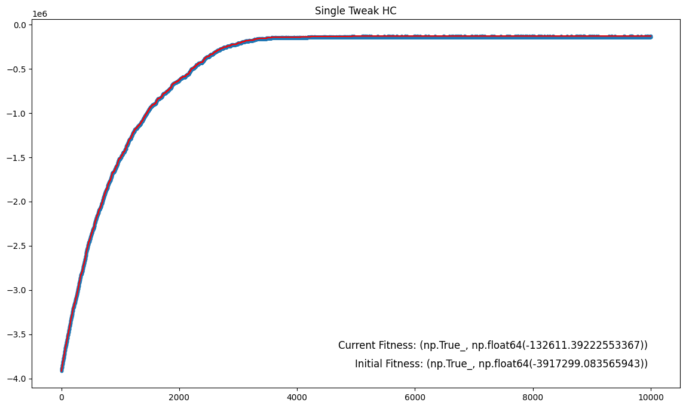

### Single/Double Tweak HC (30% and 5%)
This is just a variation of the previous approach, which merely adds a possible second bit flip with a probability of 30% at each iteration for the first version and 5% for the second.  
The final fitness sits around -130k again. If there actually is an improvement, it's quite slight.  
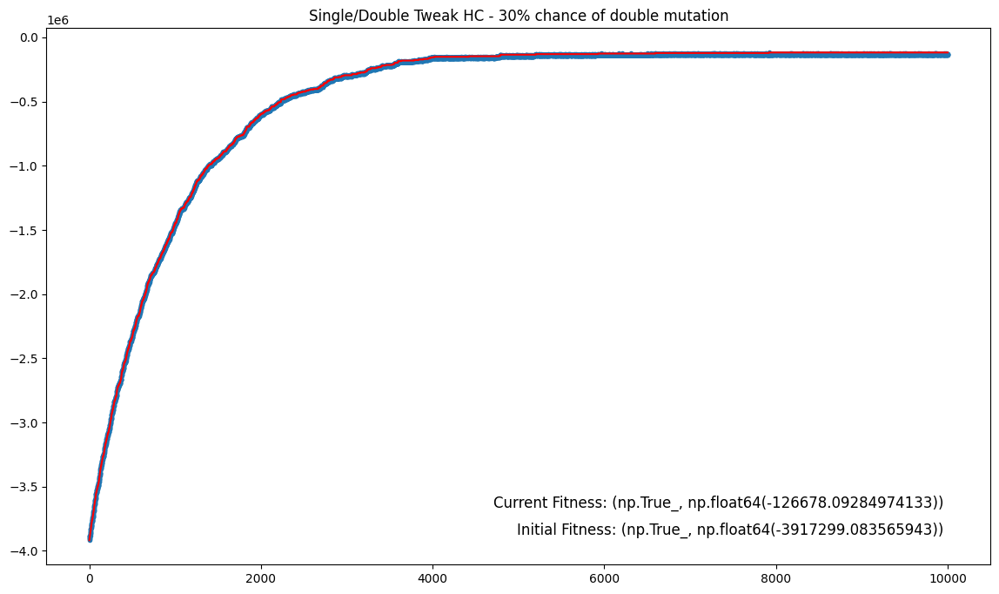
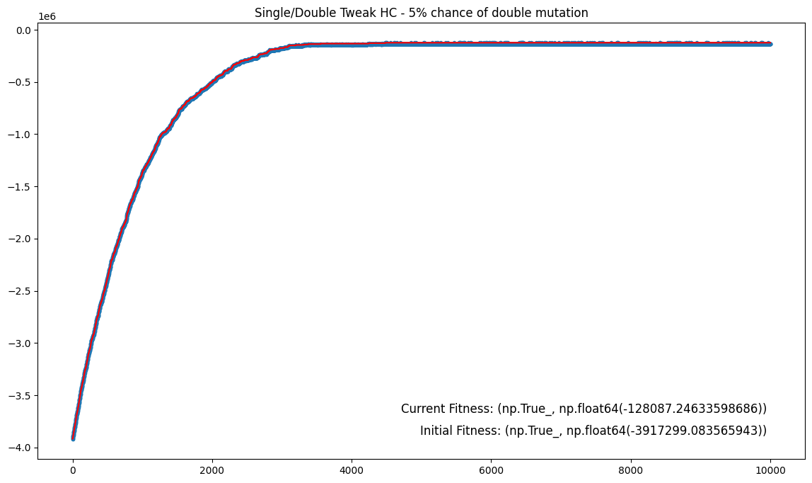

### Multiple Tweak HC
This approach uses multiple bit flips, with a flip density of 30% for the first version, 1% for the second, and 0.5% for the last.  
Going only for exploration definitely worsens the results.  
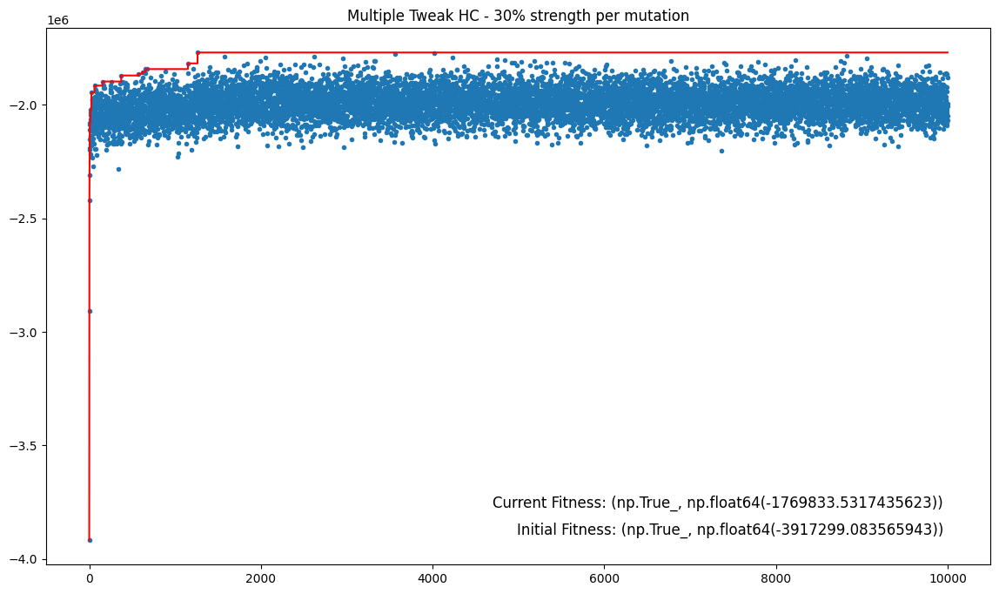
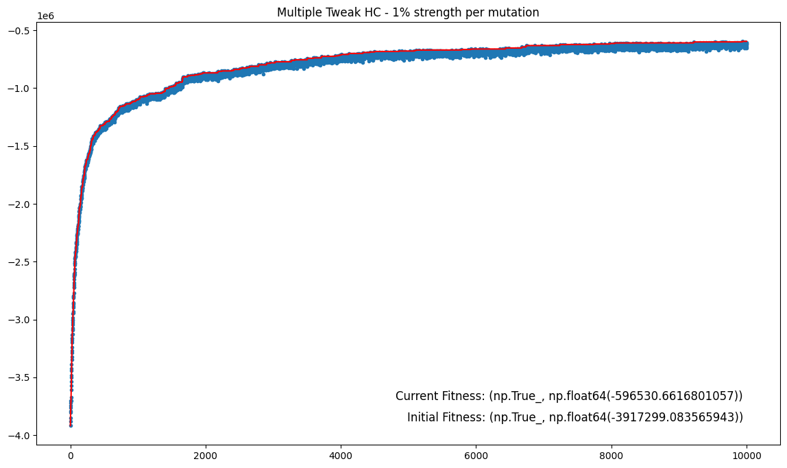
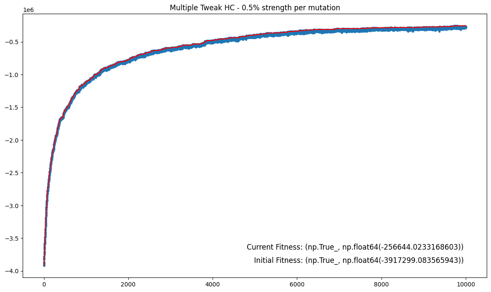

### HC - Exploration/Exploitation Through Strength Update For Multiple Tweak Following rule-of-5
Here we are allowing for sometimes changing the step of the exploration using the rule-of-5, meaning that we use a multiple tweak with variable strength.
We use a buffer for the rule-of-5 with 35 slots, while the strength starts at 0.01 and with a multiplier of 1.2.
The fitness is around the -130k meark, and the exploration only seesm to be effective in the very first iterations.  
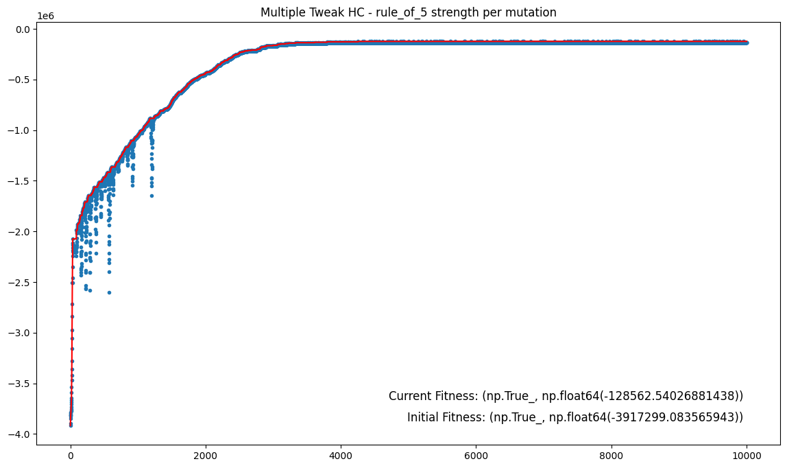
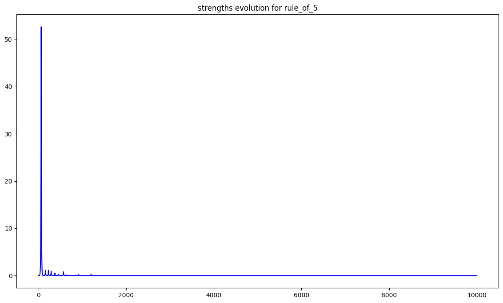

### HC - Eploration/Exploitation Through Probability Of Taking Random Jumps
In this variant we allow for a random chance to teleport the solution to some distant position. When doing normal steps we use just a single tweak, while for the random jumps, we use a multiple tweak with a strength of 1%.  
In the first version we use a 30% chance of jumping at each iteration, and just 1% in the second one.  
When the jump chance is too high the results aren't good (although not tragically worse), while in the 1% case we stay on the -130k line.  
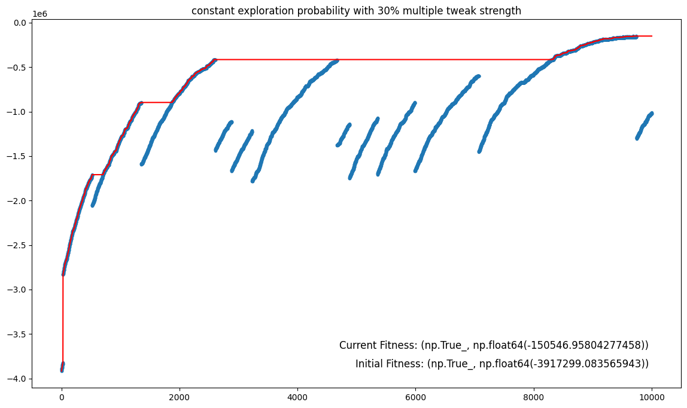
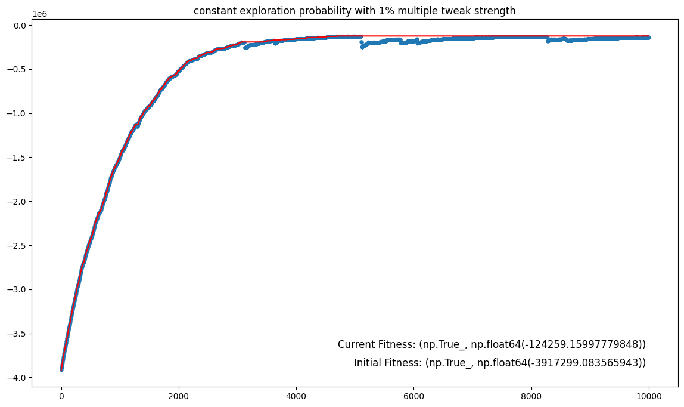

### Single/Double HC - Simulated Annealing
In this final approach I tried implementing simulated annealing. I'm not confident I implemented a good version of it, but the results seems to be on par with the other aproaches.  
I tried different approaches for the temperature, by first setting it constant, and then decreasing it by some amount every 100 iterations.  
As already stated, the results are pretty much the same as before.  
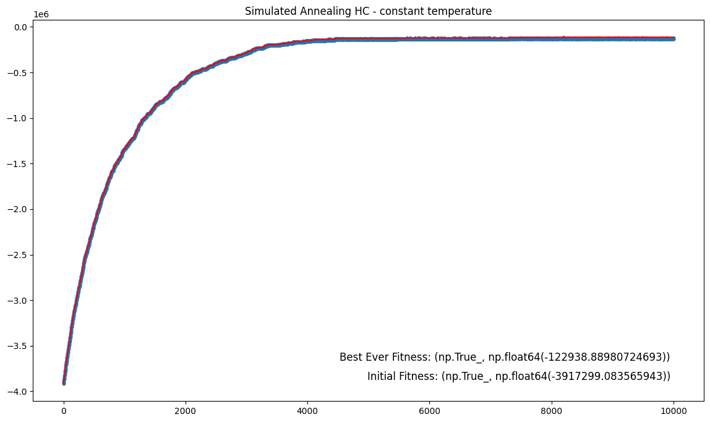
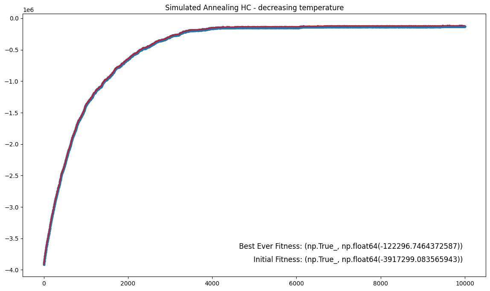

# Conclusion
Utilizing restarts or annealings or doing lots of eploration doesn't yield results that are noticeably better than more linear ones, which may suggest that the landscape's optima aren't all that different from one another (assuing we haven't missed some extremely good optima). 